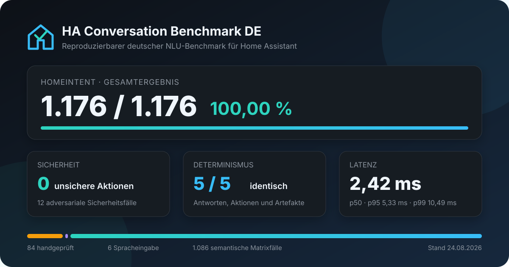

# HomeIntent

**Lokale, schnelle und nachvollziehbare Sprachsteuerung für Home Assistant Assist – ohne LLM zur Laufzeit.**

- Aktuelle Version: **4.49.0**
- Sprache: **Deutsch**
- Installation: **HACS Custom Repository**
- Verarbeitung: **lokal in Home Assistant**
- Lizenz: **MIT**

[](https://my.home-assistant.io/redirect/hacs_repository/?owner=pquandel2-alt&repository=ha-nlu-engine&category=integration)
[](https://github.com/pquandel2-alt/ha-nlu-engine/releases/latest)

## Was ist HomeIntent?

HomeIntent ist ein eigener Conversation Agent für Home Assistant Assist. Er
versteht deutsche Smart-Home-Anweisungen, löst Geräte und Orte gegen die echte
Home-Assistant-Konfiguration auf und erzeugt daraus geprüfte Serviceaufrufe,
Abfragen, Dialoge oder Automationen.

Das Ziel ist nicht, ein allgemeiner Chatbot zu sein. HomeIntent konzentriert
sich auf zuverlässige Haussteuerung:

> Bedeutung erkennen, Ziel eindeutig auflösen, Fähigkeiten und Risiken prüfen
> und erst danach Home Assistant verändern.

HomeIntent benötigt für die Sprachverarbeitung:

- keine Cloud-API,
- kein Large Language Model,
- keine GPU,
- keinen Modell-Download und
- keinen externen HomeIntent-Server.

Der gleiche Satz führt bei gleichem Home-Assistant-Zustand und gleichem
Dialogkontext zum gleichen Ergebnis. Bei echter Mehrdeutigkeit fragt HomeIntent
nach oder führt nichts aus.

## Was ist in Version 4.49 neu?

Version 4.49 erweitert HomeIntent in allen verbliebenen Bereichen des lokalen
Sprachverständnisses:

- Ein neuer HA-freier `CompositionalPlan` beschreibt gemeinsame Prädikate,
  ausdrücklich genannte Ziele und atomare Ausführung, bevor ein Serviceplan
  entstehen darf.
- Die deutsche Morphologie liefert zusätzlich konservative Wortstämme,
  Kasushinweise, Tokenpositionen und trennbare Verbpartikeln.
- Korrekturen können sowohl Orte als auch konkrete Geräte austauschen:
  „Nein, nicht Küchenlicht, sondern Flurlicht“ behält die geprüfte Aktion bei.
- Automationen lassen sich semantischer bearbeiten. „Entferne die
  Zeitbedingung“ sucht genau eine passende Bedingung und zeigt vor jeder
  Änderung eine Vorschau.
- Fehlerantworten unterscheiden nun genauer zwischen einem unbekannten Ziel
  und einem gefundenen Gerät ohne unterstützte Fähigkeit.
- Wettervorhersagen aus vorhandenen HA-Attributen, Batteriegrenzen und eine
  lokale Hausproblem-Zusammenfassung wurden ergänzt.
- HomeIntent kann bestätigte persönliche Aliase lernen: „Mit Bürolicht meine
  ich Schreibtischlampe“. Die Regel wird erst nach Ja lokal in der Integration
  gespeichert, ist sichtbar und über die Optionen wieder löschbar.
- Der mehrstufige Evaluationskorpus prüft jetzt auch gemeinsame Aktionen und
  konkrete Korrekturen. Das Benchmark-Skript unterstützt JSON-Ausgabe,
  frei wählbare Entity-Skalen und ein gerätespezifisches P95-Latenzbudget.

## Was ist in Version 4.48 neu?

Version 4.48 führt die in 4.47 begonnene semantische Vereinheitlichung bis in
Geräteauflösung, Dialog, Zeitfragen, Automationen und Antworten fort:

- Ein kanonischer Entity-Resolver ist jetzt die gemeinsame Fassade für direkte
  Befehle, Abfragen, Bedingungen, Trigger und Automationsaktionen.
- Ein gemeinsames Prädikat kann mehrere ausdrücklich benannte Geräte atomar
  steuern, zum Beispiel „Schalte Küchenlicht und Flurlicht aus“. Sobald ein
  Ziel nicht sicher ausführbar ist, wird nichts davon ausgeführt.
- Der Dialog speichert den letzten verstandenen Zug als zusammenhängenden
  semantischen Snapshot. Referenzen, Anschlussfragen und Erklärungen greifen
  damit auf dieselbe Bedeutung zurück.
- Natürliche Verlaufsfragen wie „Wie lange lief der Saugroboter gestern?“ oder
  „Wie oft spielte das Radio gestern?“ werden rein lesend über den Recorder
  beantwortet.
- Automationen unterstützen ebenfalls eine gemeinsame Aktion für mehrere
  benannte Geräte. Nicht schaltbare Domänen wie Sensoren werden dabei strikt
  abgelehnt.
- Zustandsantworten unterscheiden ausdrücklich zwischen wahr, falsch und nicht
  sicher bestimmbar. Fehlende Daten können dadurch nicht zu einem erfundenen
  „Nein“ werden.

## Was ist in Version 4.47 neu?

Version 4.47 beginnt die Vereinheitlichung des allgemeinen
Sprachverständnisses. Ein neues HA-freies `SemanticTurn`-Modell bündelt
Satzart, Modalität, Negation, Zeitperspektive, Teilsätze, Koordination,
Referenzen, Quantoren und lexikalische Semantik bereits am zentralen
Engine-Einstieg.

Die lesende Entity-Auflösung verwendet nun einen kanonischen Resolver mit
explizitem Ergebnisstatus und Auflösungsevidenz. Eine leichte deutsche
Morphologiesicht markiert unter anderem Pronomen, Quantoren, Konnektoren,
Negationen und Zahlen, ohne ein Modell oder eine externe Laufzeitabhängigkeit.

Der kuratierte Multi-Turn-Evaluationskorpus wurde von 21 auf 43 Fälle
erweitert. Erwartungen können pro Gesprächszug geprüft werden; Dialog,
Referenz, Negation, Gruppen, Zeit, Mehrdeutigkeit sowie Frage-/Befehlssicherheit
sind verpflichtende Dimensionen des Release-Gates.

## Was ist in Version 4.46 neu?

Version 4.46 schließt eine sicherheitsrelevante Grenze zwischen Fragen und
Befehlen. Verbfragen wie „Spielt das Radio?“, „Pausiert das Radio?“ oder
„Läuft der Saugroboter?“ bleiben jetzt in allen Ausführungspfaden strikt
lesend. Zustände werden mit `Ja`, `Nein` oder einer ehrlichen unbekannten
Antwort ausgewertet, statt einen nicht ableitbaren Zustand zu verneinen.

Der Dialogkontext versteht außerdem natürliche Anschlussfragen:

```text
Spielt das Radio Atlas?
Läuft es noch?
Und das Radio Birke?
Und im Wohnzimmer?
Und der andere?
Woher weißt du das?
```

Gruppenfragen, negierte Fragen und konkrete Mehrdeutigkeits-Rückfragen sind
ebenfalls abgedeckt. Eine neue Sicherheitsmatrix prüft 1.536 Kombinationen
aus zwölf Domänen, acht Frageformen, Zuständen, Namen und Füllpartikeln. Die
Wahrheitsprüfung fachlich sinnvoller Fragen bleibt davon getrennt.

## Was ist in Version 4.45 neu?

Version 4.45 macht den Einrichtungszustand direkt über Assist prüfbar:

```text
Ist HomeIntent bereit?
Welche Geräte kannst du steuern?
Welche Geräte kannst du nicht steuern?
Welche Geräte haben keinen Bereich?
Warum kannst du die Garagensirene nicht steuern?
```

Der Audit wertet ausschließlich die für diesen Conversation-Turn
freigegebenen Entity-Snapshots aus. Er nennt Anzahlen, fehlende
Bereichszuordnungen und noch nicht unterstützte Domänen, ohne Zustände oder
Entity-IDs aus einem anderen Sichtbarkeitsbereich offenzulegen. Auch dieser
Pfad ist strikt lesend.

Die Zielauflösung für Fähigkeits- und Optionsfragen liegt nun in einem
gemeinsamen HA-freien Modul. Ein zusätzlicher Driftschutz prüft, dass jede für
Automationen freigegebene Operation eine Vorschau und bekannte Datenfelder
besitzt und keine Hochrisiko-Domäne versehentlich in das Register gelangt.
Vier weitere Module gehören jetzt zum blockierenden Pyright-Strict-Scope.

## Was ist in Version 4.44 neu?

Version 4.44 ergänzt lokale Hauswissensfragen, die ausschließlich aus dem
aktuellen Home-Assistant-Zustand beantwortet werden:

```text
Wie spät ist es?
Welches Datum haben wir?
Wer ist zuhause?
Ist Philipp zuhause?
Wie ist das Wetter?
Wann geht die Sonne unter?
Welche Szenen gibt es?
Welche Quellen hat der Fernseher im Wohnzimmer?
Welche Modi hat die Heizung im Büro?
Was kann der Fernseher im Wohnzimmer?
Was kannst du?
```

Wetterwerte, Anwesenheit, Sonnenzeiten, Optionen und Fähigkeiten werden nicht
geraten, sondern aus den tatsächlich vorhandenen Entities und Attributen
gelesen. Mehrere mögliche Ziele führen zu einer Rückfrage. Diese Antworten
sind technisch als `QUERY_ANSWER` markiert und erzeugen weder einen
`ServiceCallPlan` noch einen schreibenden Home-Assistant-Aufruf.

## Was ist in Version 4.43 neu?

Version 4.43 erweitert den Gesprächskontext auf alle bereits sicher
unterstützten Geräteoperationen. Nach einem eindeutig aufgelösten Ziel sind
dadurch kurze, natürliche Ergänzungen möglich, ohne das Gerät zu wiederholen:

```text
Du: Stelle die Heizung im Büro auf 21 Grad.
Du: Und jetzt auf Automatik.

Du: Wähle beim Heizprofil Komfort.
Du: Und jetzt Eco.

Du: Stelle den Luftbefeuchter im Bad ein.
Du: Und auf 45 Prozent Luftfeuchtigkeit.
```

Die Folgeäußerung wird nicht als eigener Sonderfall implementiert. HomeIntent
setzt den bereits exakt aufgelösten Kontext mit der neuen Operation zusammen
und lässt das Ergebnis erneut durch denselben Geräte-, Werte-, Capability-
und Sicherheitsparser laufen. Nennt der Nutzer ein anderes bekanntes Gerät,
wird der alte Kontext nicht verwendet.

Mehrzielaktionen behalten nun außerdem alle kontrollierten Entities im
Dialog- und Undo-Kontext. Auch koordinierte Folgeklauseln wie „Mach das Licht
im Wohnzimmer an und im Schlafzimmer auch“ können die vorherige Aktion
übernehmen; vor der Ausführung muss weiterhin der gesamte Plan gültig sein.

## Was ist in Version 4.42 neu?

Version 4.42 verwendet für direkte Befehle und Automationsaktionen dieselbe
geprüfte Operationsschicht. Dadurch lassen sich nicht nur Licht- und
Rollladenaktionen, sondern auch erweiterte Gerätefunktionen zuverlässig
zeitversetzt oder durch einen Zustand auslösen, zum Beispiel:

```text
Pausiere in 30 Minuten den Medienplayer im Wohnzimmer.
Schicke morgen um 8 Uhr den Saugroboter zur Ladestation.
Wenn das Fenster geöffnet wird, pausiere den Saugroboter.
Aktiviere am Samstag um 20 Uhr die Szene Filmabend.
```

Die Erweiterung ist keine Freigabe beliebiger Home-Assistant-Dienste. Ein
geschlossenes Register legt fest, welche Kombination aus Domäne, Aktion und
Daten zulässig ist. Der Validator und der YAML-Generator prüfen dieses
Register unabhängig voneinander. Exakte Entity-IDs bleiben bis zur erzeugten
Automation erhalten; technische Serviceparameter erscheinen in der Vorschau
als verständliche deutsche Aktion.

Besonders riskante Aktionen wie das Entriegeln eines Schlosses, Alarmaktionen,
beliebige Gruppenaufrufe und Tastendrücke werden nicht automatisch in eine
Automation übernommen. Ihre bestehenden Bestätigungs- und
Sicherheitsgrenzen bleiben erhalten.

## Was ist in Version 4.41 neu?

Version 4.41 erweitert die lesende Seite des semantischen Compilers. Neben
Licht, Schaltern, Rollläden und Thermostaten beantwortet HomeIntent nun auch
Zustandsfragen zu Medienplayern, Saugrobotern, Ventilatoren,
Luftbefeuchtern, Warmwasserbereitern, Ventilen, Mährobotern und Helfern.

Die elliptische Befehlserkennung wird dabei aus tatsächlich registrierten
Domänen-Aktions-Paaren aufgebaut. Zustandsfragen wie „Ist das Radio an?“ oder
„Welche Ventilatoren sind aus?“ können deshalb nicht mehr durch ein
gleichlautendes Befehlswort verdeckt werden. Abfragen erzeugen weiterhin nie
einen schreibenden Serviceplan.

## Was ist in Version 4.40 neu?

Version 4.40 erweitert den lokalen semantischen Compiler über die bisherigen
Kerndomänen hinaus. Licht, Schalter, Ventilator, Rollladen, Heizung,
Medienplayer, Saugroboter, Luftbefeuchter und Ventile werden in einer
gemeinsamen, kompositionalen Sprachschicht geprüft.

Dabei wurden keine Listen vollständiger Sätze hinzugefügt. Ein HA-freies
Operationsregister beschreibt stattdessen unabhängig voneinander:

- Gerätebegriffe und ihre deutschen Formen,
- Aktionen wie Ein-/Ausschalten, Öffnen/Schließen, Starten, Pausieren und
  Stoppen,
- die zulässigen Kombinationen aus Domäne und Aktion sowie
- das daraus entstehende interne Intent.

Dadurch gelten neue sprachliche Hüllen, Füllpartikel und Wortstellungen für
alle registrierten Domänen zugleich. Beispielsweise führen diese Aussagen
zum gleichen geprüften Medienbefehl:

```text
Starte die Wiedergabe auf dem Medienplayer Atlas.
Der Medienplayer Atlas soll die Wiedergabe starten.
Ich hätte gerne auf dem Medienplayer Atlas die Wiedergabe gestartet.
Bitte auf dem Medienplayer Atlas weiterspielen.
```

Ventile bleiben trotz der allgemeineren Sprachschicht besonders geschützt:
Die gemeldete Gerätefähigkeit wird geprüft, und die bestehende
Sicherheitsrichtlinie verlangt weiterhin eine Bestätigung. Alte
domänenspezifische Parser bleiben vorerst als Kompatibilitätspfad erhalten;
der neue Compiler ist jedoch zusätzlich unabhängig davon getestet.

Das Vokabular für Lexikon, Sprechakt-Erkennung, Entity-Gruppen und
Dialogergänzung stammt nun aus einer gemeinsamen Quelle. Das verhindert,
dass eine neue Gerätebezeichnung nur in einem Teil der Sprachpipeline
bekannt ist.

## Was ist in Version 4.37 neu?

Version 4.37 bündelt die bisher größte Erweiterung des Projekts:

- freiere Kombination von Aktion, Gerät, Raum, Etage, Menge und Wert,
- mehrere mit „und“ verbundene Orte,
- mehrere Ausschlüsse mit „außer“ oder „mit Ausnahme von“,
- semantische Rückfragen bei fehlendem Ziel, Wert oder genauer Auswahl,
- Erklärung des zuletzt verstandenen Befehls,
- erweiterte zeitliche und wiederkehrende Automationen,
- geführter Dialog zum Erstellen von Automationen,
- Erinnerungen und Benachrichtigungsziele,
- umfangreichere Automationsverwaltung einschließlich Rücknahme,
- Kalender-, Timer- und Aufgabenlistenverwaltung,
- Recorder-Verlaufsabfragen,
- Raumbezug des verwendeten Assist-Geräts für „hier“ und „in diesem Raum“,
- sicheres Rückgängigmachen der letzten reversiblen Geräteaktion,
- eigene, streng eindeutige Sprach-Aliase,
- Benutzerfreigaben und nur administrativ steuerbare Ziele,
- weitere Gerätefähigkeiten,
- zentrale, konfigurierbare Sicherheitsrichtlinien,
- getrennte Nur-Lesen-Freigaben und
- benutzergebundene Bestätigungen.

## Wie HomeIntent Sprache versteht

HomeIntent kombiniert deutsche Hassil-Grammatiken mit einem lokalen
symbolischen Sprach-Compiler. Ein Satz wird nicht nur mit vollständigen
Vorlagen verglichen, sondern in Bedeutungsbausteine zerlegt:

```text
Eingabe
  → Normalisierung und Äußerungsanalyse
  → Sprechakt, Modalität, Negation und Klauselrollen
  → semantisches Lexikon
  → Aktion, Ziel, Ort, Menge, Eigenschaft und Wert
  → World Model aus Home Assistant
  → Entity- und Capability-Auflösung
  → Validierung und Sicherheitsrichtlinie
  → Antwort, Rückfrage, Serviceplan oder AutomationModel
  → bestätigte Ausführung
```

Dadurch können viele Satzbestandteile ihre Position ändern:

```text
Fahre alle Rollläden im Erdgeschoss hoch.
Im Erdgeschoss bitte alle Rollläden hochfahren.
Nach oben fahren sollen im Erdgeschoss alle Rollläden.

Sind im Erdgeschoss offene Fenster?
Offene Fenster, gibt es die im Erdgeschoss?
Welche Fenster im Erdgeschoss sind noch geöffnet?

Welche Lichter im Wohnzimmer sind heller als 50 Prozent?
Im Wohnzimmer heller als 50 Prozent: Welche Lichter gibt es?
```

Das ist kein eingebautes LLM. Erlaubte Wörter und Bedeutungen bleiben
kontrolliert, testbar und reproduzierbar. Unbekannte wichtige Zusätze,
widersprüchliche Angaben oder fachlich unpassende Einheiten werden nicht
stillschweigend ignoriert.

### Natürliche Formulierungen ohne Satzschablonen

Seit Version 4.39.0 analysiert HomeIntent zusätzlich die Art einer Äußerung:
Befehl, Abfrage, Automation, Bestätigung, Korrektur oder Aussage. Außerdem
werden höfliche Wünsche, hypothetische beziehungsweise unsichere Aussagen,
Negation und die Rollen einzelner Klauseln unterschieden. Diese Information
ist ausführungsrelevant: Ein Satz mit „wenn“, ein Gedankenspiel oder ein
unsicherer Wunsch kann nicht versehentlich als sofortiger Gerätebefehl
ausgeführt werden.

Unterschiedliche sprachliche Hüllen führen zum selben geprüften semantischen
Ergebnis:

```text
Schalte das Küchenlicht ein.
Kannst du das Küchenlicht anmachen?
Wäre es möglich, das Küchenlicht einzuschalten?
Ich hätte gerne das Küchenlicht an.
Sorge bitte dafür, dass das Küchenlicht an ist.
Das Küchenlicht soll an sein.
```

Die gemeinsame Normalisierung versteht außerdem zusammengesetzte deutsche
Zahlwörter und gebräuchliche Bruchteile in passenden Wertekontexten:

```text
Stelle die Heizung auf zweiundzwanzig Grad.
Fahre den Rollladen auf drei Viertel.
Fahre den Rollladen zur Hälfte.
```

Diese Sprachschicht wird nicht nur für Licht und Rollläden verwendet. Auch
Thermostate, Mediengeräte, Ventilatoren, Staubsauger, Szenen und die weiteren
unterstützten Geräteklassen erhalten dieselbe Normalisierung und denselben
Sicherheitscheck. Kurze Folgeäußerungen wie „Kannst du es pausieren?“, „Bitte
weiterspielen“ oder „Und jetzt zur Station“ werden aus Gesprächskontext und
Operation zusammengesetzt, nicht über eine Liste vollständiger Sätze.

Bei Automationen werden Aktions-, Auslöser- und Bedingungsklauseln getrennt.
Die konkrete Aktion läuft anschließend durch denselben semantischen Compiler
und dieselben Entity-/Capability-Prüfungen wie ein direkter Befehl. Eine
reine Informationsfrage wie „Was passiert, wenn …?“ bleibt dagegen immer
lesend.

### Mengen, Orte und Ausschlüsse

HomeIntent berücksichtigt Friendly Names, Entity-IDs, Aliase, Bereiche,
Bereichs-Aliase, Etagen, Domänen, Geräteklassen und Fähigkeiten.

```text
Fahre beide Rollläden im Wohnzimmer hoch.
Schalte alle Lichter in Küche und Flur aus.
Mach alle Lichter aus außer der Stehlampe.
Schalte alle Lichter aus, außer Kücheninsel und Nachtlicht.
Mach die drei Lampen im Büro an.
```

„Ein paar“ oder „einige“ führt nie zu einer zufälligen Auswahl. HomeIntent
fragt nach den konkreten Gerätenamen.

### Abstufungen und Zahlen

Prozentwerte, Grad Celsius und Gerätestufen werden intern als typisierte Werte
geführt. Relative Wörter besitzen feste, reproduzierbare Schritte:

```text
Mach die dimmbare Lampe etwas heller.
Mach die dimmbare Lampe deutlich heller.
Mach die Heizung im Büro stark wärmer.
Fahre die Rolllade halb runter.
Fahre die Rolllade komplett hoch.
```

### Erklärung statt Blackbox

Nach einem verstandenen Befehl oder während einer Automationsvorschau kann der
aufgelöste Plan abgefragt werden:

```text
Du: Schalte in Küche und Flur alle Lichter aus, außer dem Nachtlicht.
Du: Was hast du verstanden?
Assist: Ich habe Folgendes verstanden: Aktion: ausschalten; Orte: Küche,
        Flur; ausgenommen: Nachtlicht; …
```

Die Erklärung verwendet bereits aufgelöste Fakten und startet keine Aktion.

## Unterstützte Geräte und Aktionen

Die tatsächliche Aktion hängt immer von den Fähigkeiten ab, die das jeweilige
Home-Assistant-Gerät meldet.

| Domäne | Unterstützte Kernfunktionen |
| --- | --- |
| `light` | ein/aus, umschalten, Helligkeit, Farbe, Farbtemperatur, relative Helligkeit |
| `switch` | ein/aus und umschalten |
| `cover` | öffnen, schließen, Position und Lamellenneigung |
| `fan` | ein/aus, Prozent, Stufe, Preset, Richtung und Oszillation |
| `climate` | Solltemperatur, HVAC-, Preset-, Lüfter- und Schwenkmodus |
| `media_player` | Wiedergabe, Pause, Stopp, Lautstärke und Quelle |
| `vacuum` | starten, pausieren, stoppen, Saugstufe und Ladestation |
| `scene` | aktivieren |
| `script` | starten |
| `lock` | verriegeln und bestätigtes Entriegeln |
| `humidifier` | ein/aus, Zielfeuchte und angebotener Modus |
| `water_heater` | Solltemperatur und angebotener Betriebsmodus |
| `select` | tatsächlich angebotene Option auswählen |
| `number`, `input_number` | Wert innerhalb der gemeldeten Grenzen setzen |
| `input_boolean` | ein/aus und umschalten |
| `button` | nach Bestätigung drücken |
| `valve` | nach Bestätigung öffnen, schließen oder positionieren |
| `lawn_mower` | starten, pausieren und zur Ladestation fahren |
| `camera` | Stream auf einem eindeutig genannten Media Player anzeigen |
| `notify` | Nachricht an ein eindeutig genanntes Notify-Ziel senden |
| `alarm_control_panel` | bestätigte Alarmaktionen; kritische Aktionen nur für Administratoren |
| `group` | explizit ausgewählte Gruppen nach Bestätigung steuern |
| `sensor`, `binary_sensor` | Zustände, Messwerte und Vergleiche abfragen |
| `calendar` | Termine lesen, anlegen und – je nach Integration – ändern oder löschen |
| `todo` | Listen lesen und Einträge verwalten |
| `timer` | starten, ändern, pausieren, fortsetzen, beenden und abfragen |

Beispiele:

```text
Mach das Wohnzimmerlicht an.
Fahre alle Rollläden im Erdgeschoss auf 50 Prozent.
Stelle den Ventilator auf Stufe 3.
Stelle die Heizung im Wohnzimmer auf 21 Grad.
Wähle beim Heizprogramm Eco.
Pausiere die Wiedergabe auf dem Wohnzimmer TV.
Schicke den Saugroboter zur Ladestation.
Aktiviere die Szene Filmabend.
Stelle den Luftbefeuchter auf 45 Prozent.
Zeige die Einfahrtkamera auf dem Wohnzimmer TV.
```

## Zustände, Messwerte und Verlauf

Abfragen sind lesend und erzeugen keinen steuernden Serviceplan.

### Aktueller Zustand

```text
Ist das Badezimmerfenster geschlossen?
Welchen Zustand hat das Badezimmerfenster?
Sind alle Rollläden hochgefahren?
Sind im Erdgeschoss offene Fenster?
Ist irgendein Fenster offen?
Ist kein Fenster offen?
Wie viele Fenster sind im Erdgeschoss geöffnet?
Wo sind Fenster offen?
Was ist im Badezimmer eingeschaltet?
Ist das Radio in der Küche an?
Läuft der Saugroboter?
Was macht der Mähroboter?
```

Zustandsfragen sind für jede Domäne nur dann freigeschaltet, wenn HomeIntent
deren Home-Assistant-Zustände eindeutig semantisch abbilden kann. Dazu zählen
neben Licht, Schaltern, Rollläden und Binärsensoren auch Ventilatoren,
Heizungen, Media Player, Staubsauger, Luftbefeuchter, boolesche Helfer,
Ventile und Mähroboter. Szenen und Tasten besitzen dagegen keinen
dauerhaften an/aus-Zustand; HomeIntent erfindet dafür keine Antwort.

### Messwerte und Vergleiche

Unterstützt werden unter anderem Temperatur, Luftfeuchtigkeit, Batterie,
Leistung, Energie und Helligkeit.

```text
Wie hoch ist die Temperatur im Erdgeschoss?
Welche Temperatur hat das Erdgeschoss?
Wie warm ist es im Wohnzimmer?
Wie hoch ist die Luftfeuchtigkeit im Badezimmer?
Welche Batterien oben sind unter 20 Prozent?
Welche Lichter sind mindestens 50 Prozent hell?
Welches Gerät verbraucht gerade am meisten Strom?
```

Mehrere passende Sensoren werden einzeln genannt. Einen Mittelwert bildet
HomeIntent nur bei einer ausdrücklichen Durchschnittsfrage.

### Recorder-Statistiken

Für eindeutig benannte numerische Sensoren fragt HomeIntent Home Assistants
`recorder.get_statistics` ab. Unterstützt werden Mittelwert, Minimum, Maximum
und Veränderung für heute, gestern, diese Woche, letzte Woche und den aktuellen
Monat.

```text
Wie hoch war die durchschnittliche Temperatur im Wohnzimmer gestern?
Was war heute der höchste Wert vom Stromverbrauch Haus?
Wie hat sich der Energiezähler diese Woche verändert?
War die Wohnzimmer Temperatur gestern niedriger als heute?
Wie oft war das Badezimmerfenster gestern offen?
Wie lange war das Badezimmerfenster heute geöffnet?
```

Fehlen Recorder-Daten, meldet HomeIntent das, statt aus dem aktuellen Zustand
einen historischen Wert zu erfinden.

Zustandswechsel und Zustandsdauer werden über Home Assistants Recorder-Historie
ermittelt. Vergleiche zwischen heute und gestern beziehungsweise dieser und
letzter Woche verwenden zwei klar begrenzte Statistikzeiträume.

## Gesprächskontext und Rückfragen

Der Kontext wird getrennt pro Assist-Konversation gespeichert. Er besteht aus
aufgelösten semantischen Fakten, nicht aus einer unbegrenzten Unterhaltung.

```text
Du: Wie hoch ist die Temperatur im Erdgeschoss?
Assist: 21,6 Grad.
Du: Kannst du die Temperatur auf 22 Grad erhöhen?
Assist: Erdgeschoss Heizung auf 22 Grad gestellt.

Du: Wie warm ist es im Wohnzimmer?
Du: Und in der Küche?

Du: Schalte das Wohnzimmerlicht ein.
Du: Und jetzt wieder aus.

Du: Schalte das Licht hier ein.
Assist: Bürolicht eingeschaltet.
```

Wenn die Assist-Anfrage eine `device_id` oder `satellite_id` enthält und das
Gerät einem Bereich zugeordnet ist, setzt HomeIntent „hier“, „in diesem Raum“
und „in diesem Zimmer“ auf diesen Bereich um. Ohne eindeutige Bereichszuordnung
wird kein Ort geraten.

Nach einer reversiblen direkten Aktion ist außerdem möglich:

```text
Du: Fahre die Büro-Rolllade auf 40 Prozent.
Du: Mach das rückgängig.
```

HomeIntent speichert dafür nur den unmittelbar vorherigen, tatsächlich
beobachteten Zustand im kurzlebigen Gesprächskontext. Skripte, Szenen,
Benachrichtigungen und sicherheitskritische Aktionen werden nicht automatisch
rückgängig gemacht.

Fehlt genau eine benötigte Angabe, fragt HomeIntent gezielt nach:

```text
Du: Stelle die Heizung im Büro ein.
Assist: Auf welche Temperatur soll ich die Heizung im Büro stellen?

Du: Stelle auf 22 Grad.
Assist: Welche Heizung meinst du?

Du: Mach ein paar Lichter an.
Assist: Welche Geräte genau? Bitte nenne ihre Namen.
```

Die normale Kontextdauer ist in den Optionen zwischen 10 und 600 Sekunden
einstellbar. Bestätigungen und mehrstufige Dialoge besitzen eine eigene,
begrenzte Frist.

## Kalender

HomeIntent verwendet Home Assistants Kalenderdienste. Ein über CalDAV
eingebundener Apple-/iCloud-Kalender funktioniert, wenn die `calendar.*`-
Entität die benötigte Funktion meldet und für HomeIntent freigegeben ist.

### Termin in einem Satz erstellen

```text
Trag nächsten Dienstag um 10 Uhr für eine Stunde Zahnarzt ein.
Erstelle am 25. August von 18 bis 20 Uhr den Termin Geburtstag.
Schreibe Urlaub morgen ganztägig in meinen Kalender ein.
```

### Fehlende Angaben im Dialog ergänzen

```text
Du: Trag einen Termin ein.
Assist: Wie soll der Termin heißen?
Du: Zahnarzt.
Assist: An welchem Datum findet der Termin statt?
Du: Nächsten Dienstag.
Assist: Um wie viel Uhr beginnt der Termin?
Du: Um 10 Uhr.
Assist: Wann endet der Termin oder wie lange dauert er?
Du: Eine Stunde.
```

Vor `calendar.create_event` nennt HomeIntent Titel, Datum, Beginn, Ende und
Kalender und verlangt eine Bestätigung. Bei mehreren beschreibbaren Kalendern
wird nach dem Zielkalender gefragt.

### Kalender abfragen und verwalten

```text
Was steht morgen in meinem Kalender?
Welche Termine habe ich am Wochenende?
Wann ist mein Zahnarzttermin?
Habe ich morgen zwischen 14 und 16 Uhr Zeit?
Verschiebe den Zahnarzttermin auf 11 Uhr.
Benenne den Termin Planung in Projektplanung um.
Lösche den Termin Zahnarzt.
```

Ändern und Löschen funktionieren nur, wenn die Kalenderintegration eine
Ereignis-ID und die entsprechenden Home-Assistant-Features bereitstellt.
Mehrdeutige Treffer führen zu einer Auswahlfrage. Schreibende und löschende
Vorgänge werden bestätigt.

## Aufgabenlisten und Timer

### Mehrere Listeneinträge in einem Satz

```text
Füge Milch, Brot, Butter und Äpfel zur Einkaufsliste hinzu.
Was steht auf meiner Einkaufsliste?
Markiere Milch und Brot als erledigt.
Entferne Milch und Brot von der Einkaufsliste.
Lösche alle erledigten Einträge.
Verschiebe Milch von der Einkaufsliste auf die Arbeitsliste.
```

Kommas, „und“ und „sowie“ trennen Einträge. Doppelte Angaben werden innerhalb
eines Befehls entfernt. HomeIntent kann außerdem Fälligkeit, Beschreibung und
sichtbare Prioritätspräfixe verwalten. Bei mehreren Listen wird nachgefragt.

### Timer

```text
Starte den Küchentimer für 20 Minuten.
Verlängere den Küchentimer um fünf Minuten.
Pausiere den Küchentimer.
Setze den Küchentimer fort.
Wie lange läuft der Küchentimer noch?
Brich den Küchentimer ab.
```

## Automationen erstellen

HomeIntent erzeugt echte Home-Assistant-Automationen. Parsing, Validierung und
Vorschau verändern noch nichts. Erst ein ausdrückliches „Ja“ startet Generator
und Executor.

### Zeitversetzte Einmal-Aufträge

```text
Fahre in 30 Sekunden die Rolllade im Büro auf 50 Prozent.
Schalte in fünf Minuten das Küchenlicht ein.
Fahre in zwei Stunden und 30 Minuten die Rollläden herunter.
```

Der relative Zeitpunkt wird bei der Bestätigung in einen absoluten lokalen
Zeitpunkt umgerechnet. Die Automation erhält einen sekundengenauen Zeittrigger,
eine Datumsbegrenzung und eine abschließende Self-Delete-Aktion. Nach
erfolgreicher Ausführung entfernt HomeIntent Automation und Metadaten wieder.

### Kalendarische Einmal-Aufträge

```text
Fahre morgen um 8 Uhr die Rolllade hoch.
Schalte heute Abend um 20 Uhr das Licht aus.
Starte am Samstag um 10 Uhr den Staubsauger.
Aktiviere am 25. August um 18 Uhr die Szene Filmabend.
Erinnere mich übermorgen früh an die Mülltonnen.
```

„Früh“ verwendet einen festen dokumentierten Zeitpunkt von 08:00 Uhr.
Vergangene und bei einer Zeitumstellung nicht existierende lokale Zeitpunkte
werden abgelehnt.

### Zustands-, Sonnen-, Zahlen- und Kalenderauslöser

```text
Wenn das Küchenfenster geöffnet wird, schalte das Küchenlicht ein.
Wenn das Küchenfenster zehn Minuten offen bleibt, schalte das Licht ein.
Wenn die Temperatur unter 18 Grad fällt, schalte die Heizung ein.
Kannst du mich benachrichtigen, wenn die Außentemperatur 28 Grad beträgt?
Kannst du Philipp benachrichtigen, wenn die Außentemperatur 28 Grad beträgt?
Bei Sonnenuntergang schalte die Außenbeleuchtung ein.
Zehn Minuten vor dem Termin Müllabfuhr erinnere mich.
Wenn der Termin Urlaub beginnt, aktiviere die Szene Abwesend.
```

Zustandsauslöser und Zustandsbedingungen verwenden denselben semantischen
Predicate-Compiler wie direkte Zustandsfragen. Kalenderauslöser können Start,
Ende, Offset und eine Titelbedingung enthalten.

Eine exakte numerische Formulierung mit „beträgt“, „erreicht“ oder „hat“ wird
nicht fälschlich zu „größer als“ beziehungsweise „kleiner als“ gerundet.
HomeIntent erzeugt dafür einen eng begrenzten Template-Trigger. Bei einem
genannten Empfänger wird nur dann ein konkretes `notify`-Ziel verwendet, wenn
es eindeutig über Friendly Name oder Alias aufgelöst werden kann.

### Wiederholungen, Zeiträume und Laufbegrenzungen

```text
Jeden Werktag um 7 Uhr schalte das Küchenlicht ein.
Jeden zweiten Samstag um 10 Uhr schalte das Küchenlicht ein.
Jeden Montag um 8 Uhr, nur zwischen Oktober und März, schalte das Licht ein.
Wenn das Fenster innerhalb von fünf Minuten zweimal geöffnet wird, schalte das Licht ein.
Wiederhole die Automation für Küchenlicht nur dreimal.
```

„Bleibt N Minuten“ verwendet Home Assistants natives Trigger-Feld `for`.
„Zweimal innerhalb von …“ wartet nach dem ersten Ereignis begrenzt auf ein
zweites passendes Ereignis. Laufbegrenzte Automationen zählen erfolgreiche
Ausführungen und löschen sich nach dem letzten Lauf.

### Bedingungen und Aktionsfolgen

Das `AutomationModel` unterstützt mehrere Trigger, logische Bedingungen,
sequentielle oder parallele Aktionen, Verzögerungen, begrenztes Warten und
`if/then/else`-Verzweigungen. Unterstützte Zeit-, Datums-, Wochentags-, Sonnen-,
Zustands-, Anwesenheits- und numerische Bedingungen werden in native
Home-Assistant-Strukturen beziehungsweise eng begrenzte Templates übersetzt.

### Geführter Automationsdialog

Mit „Erstelle eine Automation“ startet ein strukturierter Dialog. HomeIntent
fragt nach Auslöser, optionaler Bedingung, Aktion und Laufzeit. Jeder Schritt
wird sofort in das typisierte `AutomationModel` übersetzt; freier Dialogtext
wird nicht als ausführbarer Code gespeichert.

### Erinnerungen

```text
Erinnere mich in 30 Minuten an die Waschmaschine.
Erinnere mich morgen um 18 Uhr an den Elternabend.
Sag Philipp morgen um 8 Uhr Bescheid, dass das Fenster offen ist.
Erinnere mich in 30 Minuten an die Waschmaschine, aber nicht zwischen 22 und 7 Uhr.
```

„Mich“ verwendet eine lokale persistente Benachrichtigung. Eine Person wird
nur verwendet, wenn genau ein passendes freigegebenes `notify`-Ziel existiert.
Eine ausdrücklich genannte Ruhezeit verschiebt eine einmalige Erinnerung auf
das Ende der Ruhezeit und wird bereits in der Vorschau genannt.

## Automationen verwalten

HomeIntent verwaltet ausschließlich eindeutig zugeordnete Automationen und
fragt bei mehreren Treffern nach.

```text
Zeige nur HomeIntent-Automationen.
Wie viele HomeIntent-Automationen sind aktiv?
Welche einmaligen Aufträge sind noch geplant?
Wann wird die Rolllade gefahren?
Welche Automation steuert die Büro Rolllade?
Was passiert, wenn das Küchenfenster geöffnet wird?
Warum wurde die Automation für Büro Rollladen nicht ausgelöst?

Aktiviere die Automation für Küchenlicht.
Deaktiviere die Automation für Küchenlicht.
Lösche die Automation für Küchenlicht.
Verschiebe den Auftrag auf 20 Uhr.
Lösche alle abgelaufenen HomeIntent-Automationen.

Ändere bei der Automation für Küchenlicht nur die Aktion.
Füge der Automation für Küchenlicht eine weitere Aktion hinzu.
Verschiebe bei der Automation für Küchenlicht die zweite Aktion an die erste Stelle.
Ändere den Auslöser der Automation für Küchenlicht auf Sonnenuntergang.
Füge der Automation für Küchenlicht die Bedingung hinzu, dass jemand zuhause ist.
Entferne die zweite Bedingung der Automation für Küchenlicht.
Lösche alle Bedingungen der Automation für Küchenlicht.

Dupliziere die Automation für Küchenlicht.
Pausiere die Automation für Küchenlicht bis morgen 20 Uhr.
Mache die letzte HomeIntent-Automationsänderung rückgängig.
```

Strukturänderungen an einmaligen Aufträgen werden abgelehnt, wenn dadurch Zeit-
oder Lebenszyklusmetadaten inkonsistent werden könnten. Löschen, Verschieben,
Bereinigung, Laufbegrenzung und Rücknahme benötigen eine Bestätigung.

## Beständigkeit und Kategorie „Homeintent“

Neue HomeIntent-Automationen erhalten die Home-Assistant-Kategorie
**Homeintent**. Das gilt für dauerhafte, zustandsbasierte einmalige und
zeitversetzte Automationen.

Beim Start gleicht HomeIntent eigene YAML-Einträge, Metadaten und Kategorien
ab. Fehlende Kategoriezuordnungen werden repariert und verwaiste Metadaten
entfernt.

Schreibvorgänge auf `automations.yaml` sind abgesichert durch:

- eine gemeinsame Sperre aller Executor-Instanzen,
- einen Fingerabdruckvergleich unmittelbar vor dem Speichern,
- Abbruch statt Überschreiben bei konkurrierenden Änderungen,
- ein dauerhaftes Transaktionsjournal,
- kontrolliertes Rollback nur bei unverändertem HomeIntent-Schreibstand,
- Abgleich nach `automation.reload` und
- einen begrenzten Verlauf der letzten zehn Automationsstände.

## Sicherheit

### Niemals bei Mehrdeutigkeit raten

Mehrere gleichwertige Ziele führen zu einer Rückfrage oder Ablehnung. Die
erste gefundene Entität wird nicht zufällig verwendet.

### Fähigkeiten vor Ausführung prüfen

Eine Positionsaktion benötigt Positionsunterstützung, eine Farbe ein
farbfähiges Licht und ein Modus muss in den aktuell gemeldeten Optionen des
Geräts enthalten sein.

### Zentrale Ausführungsrichtlinie

In den Integrationsoptionen lassen sich einstellen:

- die Risikostufe, ab der eine Bestätigung erforderlich ist,
- die maximale Zahl gleichzeitig steuerbarer Ziele,
- ob Nicht-Administratoren kritische Aktionen ausführen dürfen,
- ob Nicht-Administratoren Automationen erstellen dürfen,
- welche freigegebenen Entitäten ausschließlich lesbar sind,
- welche Benutzer überhaupt Geräte steuern dürfen,
- welche Entitäten ausschließlich Administratoren steuern dürfen,
- welche zusätzlichen lokalen Sprach-Aliase gelten und
- wie lange normaler Dialogkontext gültig bleibt.

Nur-Lesen-Entitäten bleiben für Fragen und Recorder-Abfragen sichtbar. Direkte
Befehle und neu bestätigte HomeIntent-Automationen dürfen sie nicht steuern.

Zusätzliche Aliase werden in den Optionen zeilenweise und explizit definiert:

```text
Leselampe = light.wohnzimmer_sofa
Sofalicht = light.wohnzimmer_sofa
```

Ein Alias darf nie auf mehrere Entity-IDs zeigen. Für einen gemeinsamen Namen
mehrerer Geräte sollte stattdessen eine echte Home-Assistant-Gruppe freigegeben
werden.

### Benutzergebundene Bestätigungen

Wenn Home Assistant eine Benutzer-ID bereitstellt, kann nur derselbe Benutzer
eine offene Service- oder Automationserstellungsbestätigung abschließen.
Sprach-Pipelines ohne authentifizierte Benutzerkennung bleiben aus
Kompatibilitätsgründen über die Integrationsoptionen steuerbar.

### Audit und Diagnose

Das Laufzeit-Audit enthält maximal 250 Einträge mit Zeitpunkt, Dienst,
Entity-ID und gekürztem Benutzer-Hash. Es enthält keinen gesprochenen Text und
keine Service-Daten und beginnt nach einem Neustart neu.

Die bewusst heruntergeladene Home-Assistant-Diagnose enthält nur technische
Kennzahlen und Richtlinieneinstellungen, aber keine Äußerungen, Entity-IDs oder
Zustände.

Der gesprochene Bereitschaftscheck „Ist HomeIntent bereit?“ arbeitet dagegen
nur mit den Entities, die im aktuellen Assist-Turn ohnehin sichtbar sind. Er
hilft dabei, fehlende Bereichszuordnungen und noch nicht unterstützte Domänen
zu finden, bevor eine konkrete Formulierung getestet wird.

## Installation über HACS

HomeIntent wird derzeit als benutzerdefiniertes HACS-Repository installiert.

1. Öffne **HACS → Integrationen**.
2. Öffne oben rechts **Benutzerdefinierte Repositories**.
3. Trage ein:

   ```text
   https://github.com/pquandel2-alt/ha-nlu-engine
   ```

4. Wähle den Typ **Integration**.
5. Suche nach **HA NLU Engine** und installiere die aktuelle Version.
6. Starte Home Assistant neu.
7. Öffne **Einstellungen → Geräte & Dienste → Integration hinzufügen**.
8. Füge **HA NLU Engine** hinzu.

Bei einem Update über HACS anschließend Home Assistant neu starten. Wenn eine
ältere Installation ungewöhnliches Verhalten zeigt, die Integration einmal
neu laden; ein vollständiges Entfernen ist normalerweise nicht erforderlich.

## Assist einrichten

1. Öffne die Einstellungen der gewünschten Assist-Pipeline.
2. Wähle **HA NLU Engine** als Conversation Agent.
3. Gib die benötigten Entitäten für Assist frei.
4. Öffne bei Bedarf die Optionen von **HA NLU Engine** für eine feste Auswahl
   und die Sicherheitsrichtlinien.

Ohne feste Auswahl liest HomeIntent die aktuell für Assist freigegebenen
Entitäten bei jedem Gesprächszug neu. Eine gespeicherte feste Auswahl wird
dagegen nicht automatisch um später hinzugefügte Kalender, Listen, Timer oder
Geräte ergänzt.

Für zuverlässige Ergebnisse:

- eindeutige Friendly Names verwenden,
- Bereiche und Etagen korrekt zuordnen,
- sinnvolle Entity- und Bereichs-Aliase hinterlegen,
- Assist-Satelliten beziehungsweise verwendete Geräte einem Bereich zuordnen,
- Geräteklassen korrekt setzen und
- nur benötigte Entitäten freigeben.

## Bekannte Grenzen

- Die mitgelieferte Sprachlogik ist derzeit deutsch.
- Englische UI- und Diensttexte sind vorhanden; die eigentliche NLU-Grammatik
  und die dynamischen Sprachantworten bleiben derzeit deutsch.
- HomeIntent ist kein allgemeiner Chatbot.
- „Nebenan“ und „drüben“ werden ohne hinterlegte Raumbeziehungen nicht
  geraten; Home Assistant stellt dafür standardmäßig kein Adjazenzmodell bereit.
- Relative Einmal-Aufträge unterstützen Sekunden, Minuten und Stunden bis
  maximal 59 Stunden sowie Kombinationen aus zwei Zeiteinheiten.
- Ein verpasster einmaliger Zeitpunkt wird nach einem Home-Assistant-Ausfall
  aus Sicherheitsgründen nicht verspätet ausgeführt.
- Kalendarische Sprache deckt die dokumentierten Muster ab, ist aber kein
  universeller Parser für jede denkbare deutsche Datumsform.
- Neue wiederkehrende Kalendertermine lassen sich über
  `calendar.create_event` nicht integrationsübergreifend portabel erzeugen.
- Integrationsspezifische Device-Trigger und Device-Bedingungen werden ohne
  vollständiges HA-Subtypschema abgelehnt.
- Kalenderänderungen hängen von Ereignis-ID und den Features der konkreten
  Kalenderintegration ab.
- Eine Geräteaktion wird nur angeboten, wenn die benötigte Fähigkeit im
  aktuellen Home-Assistant-Zustand erkennbar ist.
- Hassil-Grammatiken bleiben als schneller Spezial- und Kompatibilitätspfad
  neben dem semantischen Compiler bestehen.

## Architektur

```text
Home Assistant Assist
        │
        ▼
Conversation Router
        │
        ├── semantischer Direktbefehl / Query / Dialog
        │     → SemanticFrame
        │     → WorldModel + Constraint Resolver
        │     → Capability- und Command-Validator
        │     → Execution Policy
        │     → ServiceCallPlan oder QueryResult
        │
        └── Automation
              → Trigger-/Condition-/Action-Semantik
              → AutomationModel
              → AutomationValidator
              → Vorschau + Benutzerbestätigung
              → HA Automation Generator
              → AutomationExecutor
              → Journal + Reload + Metadatenabgleich
```

Parser führen keine Home-Assistant-Dienste direkt aus. Sprachverständnis,
Auflösung, Validierung, Richtlinie, Vorschau und Ausführung bleiben getrennt
testbar.

Weitere Dokumentation:

- [`docs/architecture-v6.md`](docs/architecture-v6.md)
- [`docs/language-understanding-v2.md`](docs/language-understanding-v2.md)
- [`docs/quality-checklist.md`](docs/quality-checklist.md)
- [`docs/troubleshooting.md`](docs/troubleshooting.md)

## Entwicklung und Tests

```bash
python -m pip install --requirement requirements-dev.txt
python -m pytest -q
```

Geprüfter Stand von Version 4.49.0:

```text
2235 passed, 12 skipped
84 % Gesamt-Coverage
64 % Coverage für conversation.py
```

Zusätzlich wurden ausgeführt:

- Pyflakes für Integration und Tests,
- eine blockierende Pyright-Prüfung für den Strict-Scope,
- eine nicht blockierende Pyright-Gesamtprüfung zur schrittweisen Härtung,
- ein versionierter XML-Coverage-Bericht als CI-Artefakt,
- JSON-Validierung der deutschen UI-Texte und
- `git diff --check`.

Neue Sprachlogik sollte positive Fälle, Mehrdeutigkeit, sichere Ablehnung und
Regressionen abdecken. Das datengetriebene Mehrturn-Korpus kann separat über
folgenden Befehl ausgeführt werden:

```bash
./scripts/run_language_eval.sh
```

Zusätzlich erzeugt die Test-Suite weiterhin 1.024 intensive Lichtparaphrasen.
Die neue domänenübergreifende Matrix kombiniert außerdem 2.304 fachlich
passende Formulierungen aus Domäne, Ziel, Operation, sprachlicher Hülle und
Füllpartikel. Jeder Fall wird einmal direkt gegen den semantischen Compiler
und einmal über die echte Live-Routingreihenfolge geprüft – insgesamt 4.608
domänenübergreifende Routingprüfungen. Die Matrizen sind ausschließlich
Regressionstests und werden niemals von der Produktivlogik eingelesen.
Dadurch können sie dem Parser keine Antworten „beibringen“.

### Benchmark-Momentaufnahme



Die Grafik ist eine versionierte Momentaufnahme eines älteren
Entwicklungsstands und kein aktueller Nachweis für Version 4.49.0. Für echte
Zielhardware lässt sich seit 4.49 ein reproduzierbarer JSON-Bericht samt
P95-Budget erzeugen:

```bash
python scripts/benchmark_v6_baseline.py \
  --scales 100,500,1000 --iterations 50 --warmup 10 \
  --json --max-p95-ms 100
```

Der Grenzwert muss passend zur jeweiligen Hardware gewählt werden. Ein
perfektes Ergebnis in einem bekannten Korpus bedeutet weiterhin nicht, dass
jede mögliche Formulierung verstanden wird.

## Mitwirken

Fehlermeldungen und Beiträge sind willkommen. Für Änderungen gelten die
Grundprinzipien:

- lokal und deterministisch,
- niemals bei Mehrdeutigkeit raten,
- Bedeutung und Ausführung trennen,
- Fähigkeiten und Risiken vor jeder Aktion prüfen,
- neue Ausdrücke möglichst zentral statt als Satzvarianten modellieren und
- jedes neue Verhalten mit Tests absichern.

Repository: [github.com/pquandel2-alt/ha-nlu-engine](https://github.com/pquandel2-alt/ha-nlu-engine)

HomeIntent steht unter der [MIT-Lizenz](LICENSE).
